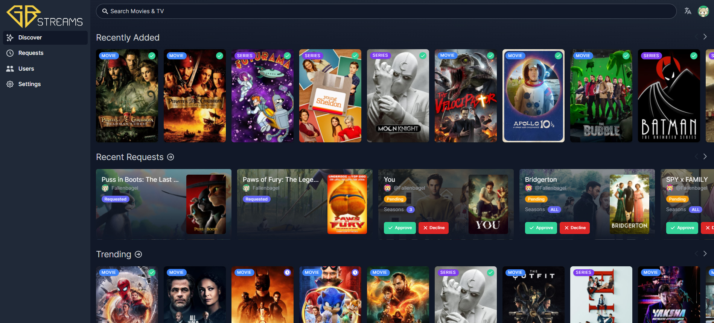

<!-- ALL-CONTRIBUTORS-BADGE:START - Do not remove or modify this section -->

<!-- ALL-CONTRIBUTORS-BADGE:END -->

  <h1>GBstreams Request</h1>
  
Welcome to GBstreams Request! This repository is a fork of the remarkable open-source project, released under the permissive MIT License. Our mission is to bring the best of this project, blended in our creative additions. In this repository, you'll find a harmonious integration of our unique theme, logo, and features alongside the original codebases. Feel free to explore, make changes, and contribute back to the community. Please note that while our additions are under the same licenses as the originals, we kindly ask you to review the license details in each subdirectory to understand the terms and conditions.

**Jellyseerr** is a free and open source software application for managing requests for your media library.
It is a fork of [Overseerr](https://github.com/sct/overseerr) built to bring support for [Jellyfin](https://github.com/jellyfin/jellyfin) & [Emby](https://github.com/MediaBrowser/Emby) media servers!

_The original Overseerr team have been busy and Jellyfin/Emby support aren't on their roadmap, so we started this project as we wanted to bring the Overseerr experience to the Jellyfin/Emby Community!_

## Current Features

- Full Jellyfin/Emby/Plex integration including authentication with user import & management
- Supports Movies, Shows and Mixed Libraries
- Ability to change email addresses for smtp purposes
- Easy integration with your existing services. Currently, Jellyseerr supports Sonarr and Radarr. More to come!
- Jellyfin/Emby/Plex library scan, to keep track of the titles which are already available.
- Customizable request system, which allows users to request individual seasons or movies in a friendly, easy-to-use interface.
- Incredibly simple request management UI. Don't dig through the app to simply approve recent requests!
- Granular permission system.
- Support for various notification agents.
- Mobile-friendly design, for when you need to approve requests on the go!

  (Upcoming Features include: Multiple Server Instances, and much more!)

With more features on the way! Check out our [issue tracker](https://github.com/fallenbagel/jellyseerr/issues) to see the features which have already been requested.

## Preview

## Contributing

You can help improve Jellyseerr too! Check out our [Contribution Guide](https://github.com/fallenbagel/jellyseerr/blob/develop/CONTRIBUTING.md) to get started.

## Contributors ✨

Thanks goes to all wonderful people who contributed directly to Jellyseerr and Overseerr.
